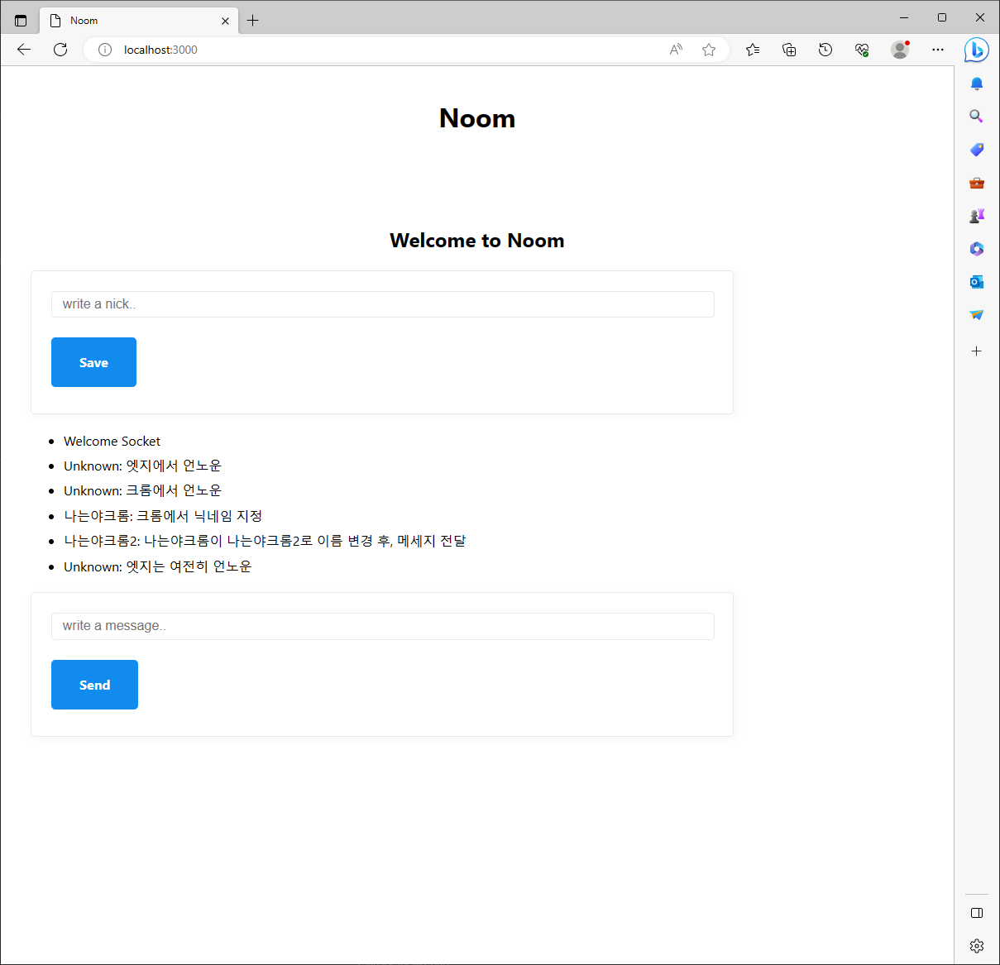

## nomad

---

### 코드 챌린지 - 1 (48시간)

- 백엔드의 Websockets(ws)와 프런트엔드의 Vanilla Javascript 를 사용하여 간단한 실시간 채팅을 구현합니다.
- 백엔드 코드는 src/server.js 그리고 프런트엔드 코드는 src/public/app.js.
- 추가 포인트: 사용자가 닉네임을 변경할 수 있습니다.

